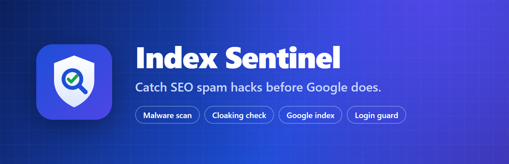
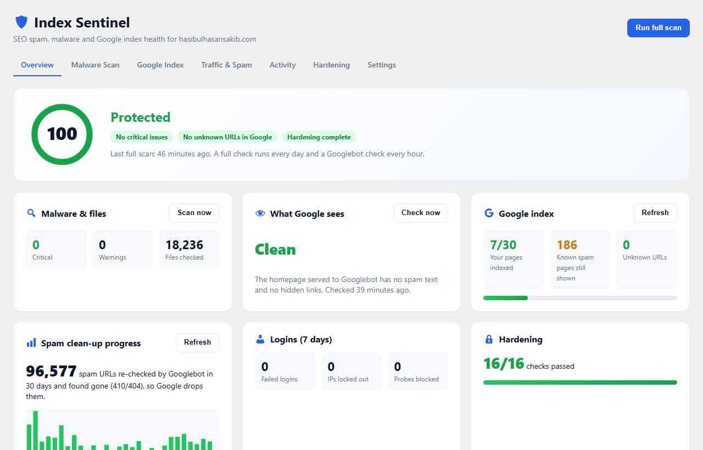
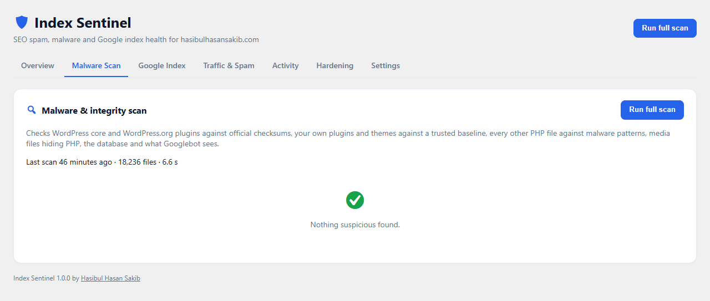
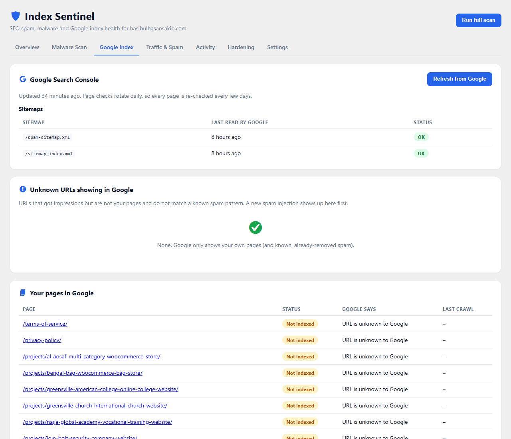
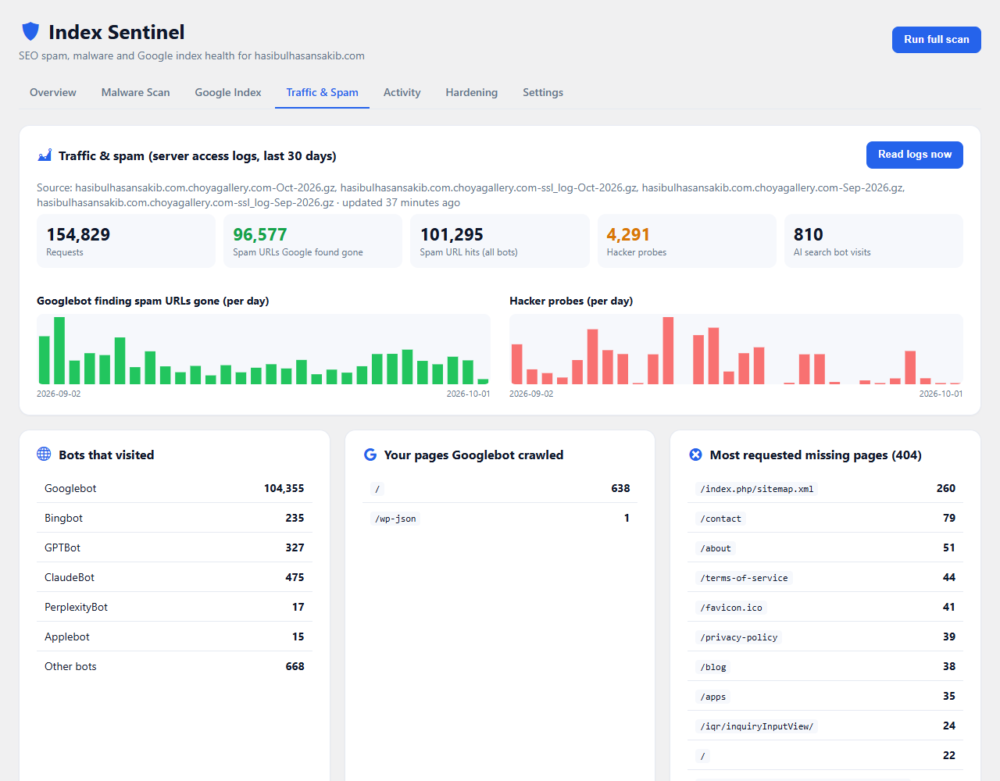
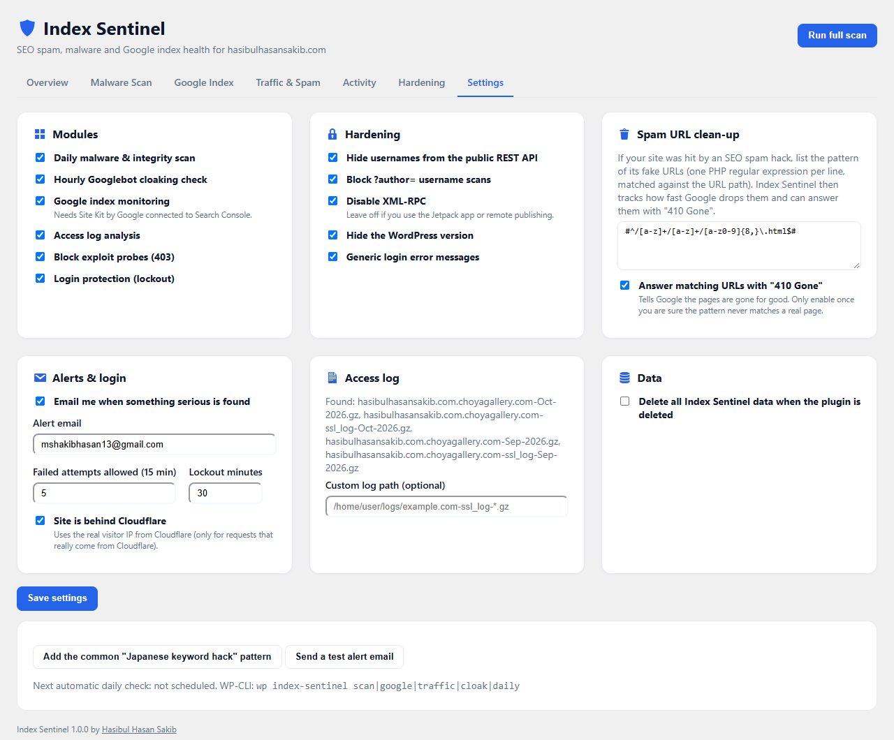

<p align="center">
  
</p>

<p align="center">
  <a href="https://github.com/hasibulhasansakib/index-sentinel/releases"></a>
  
  
  <a href="LICENSE"></a>
</p>

# Index Sentinel – SEO Spam & Malware Monitor

**Catch SEO spam hacks before Google does.**

Index Sentinel is a free WordPress plugin that watches the two things an SEO spam hack attacks: **your files** and **your Google results**. It finds the infection, checks what Googlebot really sees, warns you the day an unknown URL appears in Google, and tracks the clean-up until Google forgets the spam.

It was built after cleaning a real "Japanese keyword hack" that had pushed **130,000+ spam pages** into Google's index. During that clean-up, Googlebot re-checked about **96,000 spam URLs in 30 days**. Index Sentinel shows exactly that kind of progress on one screen.



## Features

| | |
|---|---|
| 🛡️ **Malware & integrity scan** | Core and WordPress.org plugins vs. official checksums; your own plugins/themes vs. a trusted baseline; malware signatures for everything else. |
| 🕵️ **Hacker tricks** | PHP hidden in images/fonts, hidden PHP files, PHP in uploads, self-nested folders used by spam hacks. |
| 👁️ **Cloaking check** | Every hour, fetches your homepage as Googlebot and looks for spam text and hidden links. |
| 🔎 **Google index** *(via Site Kit)* | Indexed / not indexed for every page, sitemap status, and **Unknown URLs** that get impressions: the earliest sign of a new injection. |
| 📉 **Spam clean-up tracker** | From your access log: how many spam URLs Googlebot re-checked and found gone, day by day. Optional **410 Gone** for spam URLs. |
| 🤖 **Traffic insights** | Googlebot, Bingbot and AI search bots (ChatGPT, Claude, Perplexity), hacker probes, top 404s. |
| 🔐 **Login protection** | IP lockout after repeated failures, login log, instant alert when a new administrator appears. |
| 🧱 **Hardening** | Hide usernames, block author scans, disable XML-RPC, hide the WP version, generic login errors, plus a checklist with fixes. |
| 📧 **Smart alerts** | One email per new serious problem. Never the same alert twice. |
| 🧰 **Quarantine** | Move a suspicious file into a locked folder with one click; restore it just as easily. |

## Screenshots

| Malware scan | Google index |
|---|---|
|  |  |
| **Traffic & spam** | **Settings** |
|  |  |

## Installation

1. Download the latest `index-sentinel.zip` from [Releases](https://github.com/hasibulhasansakib/index-sentinel/releases) (or install from WordPress.org once listed).
2. In WordPress go to **Plugins → Add New → Upload Plugin**, choose the zip, then **Activate**.
3. Open **Index Sentinel** and click **Run full scan**.
4. Optional: add your spam URL pattern in **Settings** (one click adds the Japanese keyword hack pattern).
5. Optional: install **Site Kit by Google** and connect Search Console for the Google Index tab.

Updates are delivered through the normal WordPress update system once the plugin is on WordPress.org.

## WP-CLI

```bash
wp index-sentinel scan
wp index-sentinel google
wp index-sentinel traffic
wp index-sentinel cloak
wp index-sentinel daily
wp index-sentinel accept-baseline
```

## For developers

Index Sentinel is modular and built to be extended by add-ons:

| Hook | Type | Use |
|---|---|---|
| `index_sentinel_loaded` | action | Everything is wired; register your add-on. |
| `index_sentinel_tabs` / `index_sentinel_render_tab_{id}` | filter / action | Add a dashboard tab. |
| `index_sentinel_signatures` | filter | Add or change malware patterns. |
| `index_sentinel_scan_findings` | filter | Add findings from your own checks. |
| `index_sentinel_hardening_checks` | filter | Add checklist items. |
| `index_sentinel_spam_patterns` | filter | Provide spam URL patterns. |
| `index_sentinel_firewall_probes` | filter | Change blocked probe patterns. |
| `index_sentinel_score` | filter | Adjust the security score. |
| `index_sentinel_daily_jobs` | action | Run extra work in the daily job. |

Code: PHP 7.4+, namespaced (`IndexSentinel\`), no build step, no external libraries. Storage: one log table (`{prefix}index_sentinel_log`) and `index_sentinel_*` options. Schema changes run through `IndexSentinel\Upgrade`.

## External services

Only the WordPress.org checksum API (during scans), the Google Search Console API through Site Kit (only if you connected it), and requests to your own site. No tracking, no ads, no account. Details in [readme.txt](readme.txt).

## Security

Found a security issue? Please email **info@hasibulhasansakib.com** instead of opening a public issue. See [SECURITY.md](SECURITY.md).

## Author

Built by **[Hasibul Hasan Sakib](https://hasibulhasansakib.com/)**, WordPress & WooCommerce developer and AI automation specialist.
Need help cleaning a hacked site or building a custom plugin? [Get in touch](https://hasibulhasansakib.com/contact/).

## License

[GPL-2.0-or-later](LICENSE)
